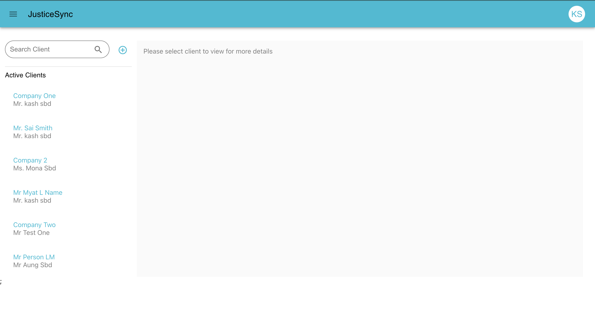

Case Management System (JusticeSync)

User Authentication: Lawyers should be able to securely log in to the system using their credentials.

Client Management: Lawyers should be able to create, and view, client records. Each client record should include essential details such as name, contact information, person or company type, and any relevant notes.

Case Management: Lawyers should be able to create, and view, case records associated with each client. Each case record should include details such as case type, case number, case status, associated parties and key dates.

Time Entry: Lawyers should be able to log billable hours spent on each case accurately. The system should allow lawyers to enter the date, time spent, description of work done, and associate the time entry with a specific case.

Tech Stacks:
Frontend: React.js, React Query
Backend: Express.js, Json Web Token, Postgres, Prisma ORM 

# Class Diagram

# ER Diagram

# ScreenShots

1. Login Screen

2. Staff List Screen

3. Create Staff Screen

4. Client List Screen

5. Create Client Screen

6. Case List Screen

7. Create Case Screen

8. Timeentry List Screen

9. Create Timeentry Screen
